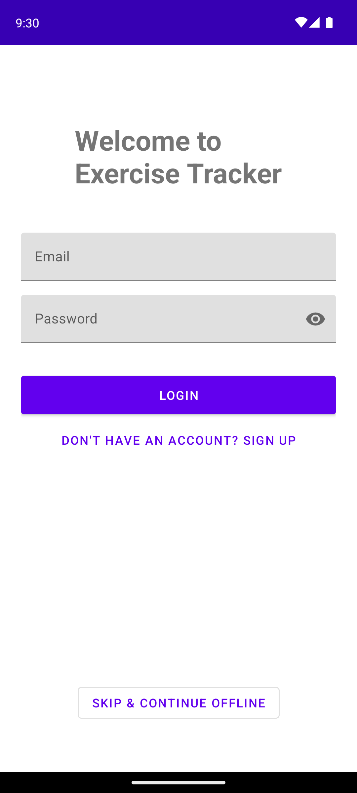
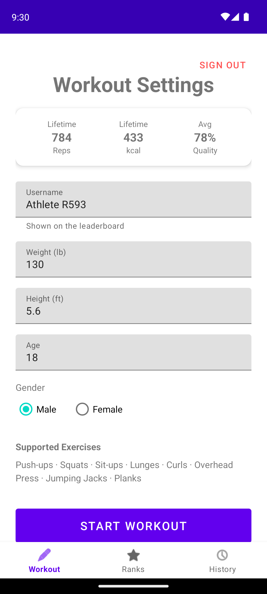
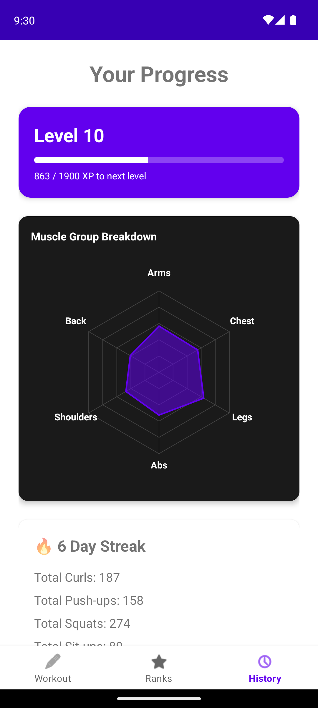

# AI Exercise Tracker

[](https://github.com/asood8/Exercise-Tracker/actions/workflows/ci.yml)

An Android app that counts your reps through the phone's camera. Prop your phone up, start moving, and it tracks push-ups, squats, curls and five other exercises, scores your form on every rep, and estimates how many calories you burned. There's nothing to log by hand.

Pose detection runs entirely on the device with [MediaPipe](https://developers.google.com/mediapipe), so no video ever leaves your phone.

<p align="center">
  
  &nbsp;
  
  &nbsp;
  
</p>

## Features

- Rep counting for push-ups, squats, sit-ups, lunges, bicep curls, overhead press and jumping jacks, plus a hold timer for planks. Reps are counted out loud as you go.
- A form score out of 100 for each rep and each plank hold, with live cues like "Go lower!" or "Keep chest up!" and optional spoken coaching
- Calorie estimates based on how your body actually moves, adjusted for your weight, height, age and sex
- Pick an exercise before you start, and switch to another one mid-workout without ending the session. Tracking starts with a 3-2-1 countdown once you're in frame, and you can pause at any point.
- Optional set goals like 3 × 15, with a progress ring, a rest timer between sets, and a suggested next goal based on how your last session went
- Routines that string exercises together, like three rounds of push-ups, sit-ups and a plank, and move on to the next exercise by themselves. A few come built in, and you can make your own.
- A rep-by-rep breakdown after each workout, with the option to fix the count if the camera missed or double-counted something. Corrected workouts are saved, but kept off the leaderboard.
- Saving works without a connection. The workout is kept on the phone and uploads once you're back online.
- Email/password accounts with email verification and password reset, or a guest mode if you just want to try it. A guest account can be turned into a full account later without losing any workouts.
- A progress screen with lifetime totals, workout time, an XP and level system, current and best streaks, weekly charts, personal records, and a radar chart showing which muscle groups you've trained most
- Achievements for milestones like your first 1,000 reps, a 7-day streak or a 2-minute plank
- An optional evening reminder if you're about to break your streak
- Pounds and feet, or kilograms and centimetres
- An opt-in public leaderboard ranked by total reps, where you show up under a username you pick
- Download everything the app has stored about you as a JSON file, or delete your account and all of its data, from the Home screen

## How it works

Frames from the camera are downscaled and passed to MediaPipe's Pose Landmarker (the bundled `pose_landmarker_lite` model), which returns 33 body landmarks per frame.

Each exercise has its own tracker class that turns those landmarks into joint angles and runs a small state machine. A squat, for example, goes standing → descending → bottom → ascending, and the rep counts when you're back up. At the end of each rep the tracker checks a few form rules (depth, torso lean, knee tracking and so on) and takes points off for each one you missed.

Before the trackers see anything, the landmarks are smoothed over the last few frames, and a rep that finishes faster than a person realistically could is thrown out. That keeps ordinary camera jitter from turning into phantom reps.

Detection runs on a MediaPipe background thread while the workout screen's timers and buttons run on the main one, so every change to the trackers, the calorie model and the workout phase happens under a single lock. Ending a workout stops new frames before it reads the counts, so a rep can't land half-counted in the summary.

You pick the exercise before you start, and only that exercise's tracker runs. That keeps one movement from counting as two different exercises (a deep lunge can look a lot like a squat). You can switch exercises mid-workout, and everything counted so far stays in the session. A routine does the switching for you: once you hit the target for one exercise, it gives you a rest and then sets up the next.

Calories come from a simple physics model rather than a fixed calories-per-minute table. The app estimates your center of mass from the landmarks, weighting each body segment by its typical share of body mass. How fast that point moves is mapped to a MET value, which is converted to calories using your body weight. It's still an estimate, but it reacts to how hard you're actually working.

### Accounts and data

Accounts are Firebase Authentication: email and password, with verification and password reset, or an anonymous guest account that can be upgraded later without losing anything. Workouts are saved to Cloud Firestore under the signed-in account, and Firestore's offline cache means a workout saved with no connection uploads itself once there is one.

The rules in [`firestore.rules`](firestore.rules) do the enforcing, rather than the app:

- a workout can only be read, created or deleted by the account it belongs to
- leaderboard entries accept only the fields the app writes, can't gain more than 2,000 reps in a single save, and have to use a username the writer has claimed
- usernames are unique, ignoring case. Each one is claimed in a transaction against a `usernames` collection keyed by the lowercase name, so two accounts can't end up with the same name.

App Check (Play Integrity in release builds) keeps other clients out of the project, and nothing is stored that can't be removed: deleting an account clears its workouts, leaderboard entry, username claim and login together.

## Tech stack

- Kotlin, with XML layouts and AppCompat
- CameraX for the camera feed
- MediaPipe Tasks Vision (Pose Landmarker) for on-device pose detection
- Firebase Authentication, Cloud Firestore and App Check
- WorkManager for the evening streak reminder
- Gradle with the Kotlin DSL (AGP 8.3, min SDK 24, target SDK 34). Release builds are minified with R8, and signed from properties kept outside the repo.
- JUnit unit tests for the logic that doesn't need a camera, run by GitHub Actions along with lint and a build on every push

## Getting good tracking

- Put the phone far enough away that your whole body is in frame. Most trackers need to see everything from your shoulders down to your ankles.
- The workout screen tells you where to put the phone for the exercise you picked. In general, face the camera for curls, overhead press, squats and jumping jacks, and set it up side-on for push-ups, sit-ups, planks and lunges.
- For the side-on exercises, turn the phone sideways. The workout screen switches to landscape (tap the rotate button if auto-rotate is off), and your body fills much more of the frame.
- Good, even lighting helps a lot. Backlighting from a window is the most common reason tracking drops out.
- The status bar at the top turns green once the app has found you.

## Project structure

```
app/src/main/
├── assets/pose_landmarker_lite.task     MediaPipe pose model
├── java/com/example/exercisetracker/
│   ├── MainActivity.kt                  camera, pose detection and the live workout screen
│   ├── *Tracker.kt                      one rep counter per exercise
│   ├── AngleUtils.kt                    joint angle math shared by the trackers
│   ├── CalorieEstimator.kt              center-of-mass calorie model
│   ├── LevelingUtils.kt                 XP, levels and muscle chart scaling
│   ├── Routine.kt, GoalSuggestions.kt   routines, set goals and suggested goals
│   ├── AccountData.kt                   data export and account deletion
│   ├── LoginActivity.kt, HomeActivity.kt, SummaryActivity.kt,
│   │   HistoryActivity.kt, LeaderboardActivity.kt
│   └── OverlayView.kt, MuscleStatsView.kt    custom views (skeleton overlay, radar chart)
├── app/src/test/                        unit tests (goals, routines, streaks, levels, rules)
└── res/layout/                          XML layouts
```

The app's `google-services.json` ties it to a particular Firebase project and isn't in the repo, so this copy is here to read rather than to build.

## Privacy

Camera frames are processed on the phone and are never recorded or uploaded. When you save a workout, the app stores your rep counts, calories, form scores, workout length, any goal or routine you followed and a timestamp in Firestore under your account. The streak reminder runs entirely on your phone. You only appear on the leaderboard if you turn on "Appear on Global Rankings" when saving, and it shows the username you set on the home screen, never your email. At the bottom of the home screen you can download all of your data, or delete your account along with everything in it.

## License

Released under the [MIT License](LICENSE).
